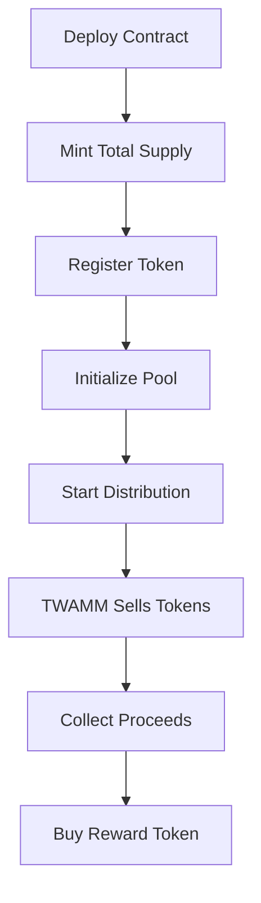

# Beedle
Beedle is an automatic price discovery and liquidity bootstrapping protocol written in [Cairo](https://github.com/starkware-libs/cairo) built on top of [Ekubo](https://github.com/EkuboProtocol).

## Overview

Distribution mechanism:
1. Creates a new ERC20 token with a fixed supply
2. Registers the token with Ekubo's token registry
3. Creates a liquidity pool on Ekubo
4. Distributes the entire token supply over time using a TWAMM sell order
5. Collects payment tokens from the sale
6. Automatically reinvests proceeds into a reward token using TWAMM buy orders

This approach ensures:
- Fair and gradual token distribution
- Price discovery through continuous trading
- Automatic compounding of proceeds
- No need for manual market making

## Architecture

### Core Components

#### EkuboDistributedERC20 Contract
The main contract that inherits from OpenZeppelin's ERC20Component and implements the distribution logic.

**Key Features:**
- ERC20 token functionality (mint, transfer, approve, etc.)
- Ekubo pool initialization
- TWAMM order management
- Proceeds claiming and reinvestment
- Token registry integration

#### External Dependencies
- **OpenZeppelin Contracts**: For battle-tested ERC20 implementation
- **Ekubo Protocol**: 
  - Core: Pool creation and management
  - Positions: NFT positions for TWAMM orders
  - TWAMM Extension: Time-weighted trading functionality
  - Token Registry: Token registration for Ekubo ecosystem

### Distribution Flow



## Installation

### Prerequisites
- [Scarb](https://docs.swmansion.com/scarb/) v2.10.1 or higher
- [Starknet Foundry](https://foundry-rs.github.io/starknet-foundry/) v0.44.0 or higher
- A Starknet RPC endpoint
- A funded Starknet account for deployment

### Setup
```bash
# Clone the repository
git clone https://github.com/your-org/twamm-distributed-erc20
cd twamm-distributed-erc20

# Install dependencies
scarb build

# Run tests
snforge test
```

## Usage

### 1. Deploy the Contract

The contract constructor requires the following parameters:

```cairo
struct ConstructorParams {
    name: ByteArray,              // Token name (e.g., "My Token")
    symbol: ByteArray,            // Token symbol (e.g., "MTK")
    total_supply: u128,           // Total supply (e.g., 1000000)
    pool_fee: u128,               // Ekubo pool fee (e.g., 3000 = 0.3%)
    tick_spacing: u32,            // Pool tick spacing (e.g., 60)
    payment_token: ContractAddress,    // Token to receive (e.g., LORDS)
    reward_token: ContractAddress,     // Token to buy with proceeds
    core_address: ContractAddress,     // Ekubo Core contract
    positions_address: ContractAddress, // Ekubo Positions contract
    extension_address: ContractAddress, // Ekubo TWAMM extension
    registry_address: ContractAddress,  // Token Registry contract
}
```

Deploy using the provided script:
```bash
./scripts/deploy.sh
```

### 2. Initialize the Distribution Pool

After deployment, create the Ekubo liquidity pool:

```cairo
// Call from contract owner
contract.init_distribution_pool();
```

This creates a new pool with:
- Token pair: Your token <-> Payment token
- Fee tier: As specified in constructor
- Initial price: 1:1 (can be adjusted by initial liquidity)

### 3. Start Token Distribution

Begin the TWAMM sell order:

```cairo
// end_time is Unix timestamp when distribution ends
contract.start_token_distribution(end_time: u64);
```

**Important considerations:**
- `end_time` must be in the future
- The contract will calculate the sale rate as: `total_supply / (end_time - start_time)`
- Start time is automatically rounded down to the nearest 16-second interval
- Longer distribution periods result in more gradual token release

### 4. Claim and Reinvest Proceeds

Anyone can call this function to:
1. Withdraw accumulated payment tokens from sales
2. Place a TWAMM buy order for the reward token

```cairo
contract.claim_and_sell_proceeds();
```

This should be called periodically to:
- Compound returns by buying more reward tokens
- Keep the reward distribution active
- Prevent large accumulated balances

## Contract Methods

### Admin Functions

#### `init_distribution_pool()`
Initializes the Ekubo pool for token distribution.
- Can only be called once
- Requires pool not already initialized
- Returns pool ID from Ekubo

#### `start_token_distribution(end_time: u64)`
Starts the TWAMM sell order for gradual distribution.
- Requires pool to be initialized first
- Can only be called once
- Transfers entire token balance to Ekubo positions contract
- Creates NFT position for tracking

### Public Functions

#### `claim_and_sell_proceeds()`
Claims accumulated proceeds and reinvests in reward token.
- Can be called by anyone
- No minimum proceeds required
- Updates reward distribution rate

### View Functions

#### Token Information
- `get_payment_token() -> ContractAddress`
- `get_reward_token() -> ContractAddress`
- `get_extension_address() -> ContractAddress`

#### Pool Information
- `get_pool_id() -> u256`
- `get_pool_fee() -> u128`
- `get_tick_spacing() -> u32`
- `get_distribution_pool_key() -> PoolKey`

#### Distribution Status
- `get_position_token_id() -> u64`
- `get_distribution_start_time() -> u64`
- `get_distribution_end_time() -> u64`
- `get_token_distribution_rate() -> u128`
- `get_reward_distribution_rate() -> u128`

#### Utility
- `get_deployed_at() -> u64`
- `get_distribution_order_key() -> OrderKey`
- `get_reward_order_key() -> OrderKey`

## Testing

The project includes comprehensive test coverage:

```bash
# Run all tests
snforge test

# Run specific test file
snforge test test_constructor

# Run with verbose output
snforge test -- --nocapture
```

### Test Categories

1. **Unit Tests** (`tests/unit/`)
   - Constructor validation
   - Pool initialization
   - Distribution start logic
   - Proceeds claiming
   - Getter functions

2. **Integration Tests** (`tests/integration/`)
   - Full deployment flow
   - Multiple claim cycles
   - Time-based scenarios
   - Edge cases

3. **Fuzz Tests** (`tests/fuzz/`)
   - Time rounding behavior
   - Rate calculations
   - Distribution amounts

### Mock Contracts

The test suite includes mocks for external dependencies:
- `MockCore`: Simulates Ekubo core functionality
- `MockPositions`: Handles TWAMM position creation
- `MockTokenRegistry`: Token registration simulation
- `MockERC20`: Basic ERC20 for testing


## Disclaimer

This software is provided "as is", without warranty of any kind. Users should understand the risks involved in DeFi protocols and TWAMM trading mechanisms before interacting with these contracts.
